# 🚀 InstaCares Deployment Status

[](https://github.com/instacares-org/instacaresv2/actions/workflows/production-deploy.yml)
[](https://github.com/instacares-org/instacaresv2/actions/workflows/deploy.yml)

## 🌐 Live Environments

| Environment | Status | URL | Last Deployed |
|-------------|---------|-----|---------------|
| **Production** | ✅ Live | [instacares.net](https://instacares.net) | Auto-updated |
| **Staging** | 🔄 Available | [staging.instacares.net](https://staging.instacares.net) | Manual |

## 📊 Deployment Interface

### 🎛️ Quick Actions

- **[📋 View All Deployments](https://github.com/instacares-org/instacaresv2/actions/workflows/production-deploy.yml)**
- **[🚀 Manual Deploy](https://github.com/instacares-org/instacaresv2/actions/workflows/production-deploy.yml)** (Click "Run workflow")
- **[📈 Deployment History](https://github.com/instacares-org/instacaresv2/deployments)**
- **[🏷️ Version Tags](https://github.com/instacares-org/instacaresv2/tags)**

### 🔧 Manual Deployment Options

When using **[Run workflow](https://github.com/instacares-org/instacaresv2/actions/workflows/production-deploy.yml)**, you can:

```yaml
Version: v1.2.3           # Custom version or leave empty for auto
Environment: production   # Choose production or staging
Force Deploy: false       # Bypass update checks if needed
```

## 📈 Current Deployment Info

- **Latest Version**: Auto-generated on each deployment
- **Deployment Method**: GitHub Actions CI/CD
- **Server**: Hostinger VPS with PM2
- **Deployment Time**: ~3-5 minutes
- **Zero Downtime**: ✅ Rolling deployments

## 🔄 Deployment Process

```mermaid
graph TD
    A[Push to Main] --> B[GitHub Actions]
    B --> C[Build & Test]
    C --> D[Generate Version]
    D --> E[Deploy to Hostinger]
    E --> F[Health Check]
    F --> G[✅ Live]
    F --> H[❌ Auto Rollback]
```



## 📋 Version History

Deployment versions follow semantic versioning: `v{MAJOR}.{MINOR}.{PATCH}`

| Version | Date | Commit | Status |
|---------|------|---------|---------|
| Latest | Auto | Auto | [View](https://github.com/instacares-org/instacaresv2/actions) |

## 🚨 Emergency Procedures

### Quick Rollback
1. Go to **[Actions](https://github.com/instacares-org/instacaresv2/actions)**
2. Find last successful deployment
3. Click **"Re-run all jobs"**

### Force Deploy
1. Click **[Run workflow](https://github.com/instacares-org/instacaresv2/actions/workflows/production-deploy.yml)**
2. Set **Force Deploy: true**
3. Click **"Run workflow"**

### Manual Server Access (Emergency)
```bash
# SSH into server
ssh your-user@your-hostinger-server.com

# Check status
pm2 list

# View logs
pm2 logs instacares

# Restart if needed
pm2 restart all
```

## 📞 Support Links

- **[Application Logs](https://github.com/instacares-org/instacaresv2/actions)** - GitHub Actions logs
- **[Server Monitoring](#)** - PM2 process status
- **[Error Tracking](#)** - Application error logs
- **[Performance](#)** - Server performance metrics

## 🔧 Development Workflow

### For Developers

1. **Automatic Deployment**
   - Push to `main` branch
   - GitHub Actions handles everything
   - Live in ~5 minutes

2. **Manual Deployment**
   - Use GitHub interface
   - Select version and environment
   - Monitor progress in real-time

3. **Version Control**
   - Every deployment gets a version tag
   - Easy rollback to any version
   - Complete audit trail

---

## 🎯 Features

- ✅ **One-Click Deployment** through GitHub interface
- ✅ **Automatic Version Control** with semantic versioning
- ✅ **Zero Downtime Deployments** with rolling updates
- ✅ **Health Checks** and automatic rollback
- ✅ **Complete Audit Trail** of all deployments
- ✅ **Environment Management** (production/staging)
- ✅ **Emergency Procedures** for quick recovery

**Last Updated**: Auto-updated on each deployment